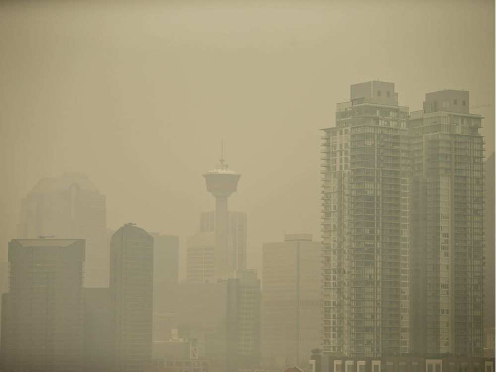

Welcome to the first Women's Data Science Study group.

Today, we had an introdution to [R](https://www.r-project.org/) and [RStudio](https://www.rstudio.com/) and we learned a little bit about [R Markdown](https://rmarkdown.rstudio.com/).

Now, we will create a HTML file with interactive plots using the historical air quality data available at [the City of Calgary's open data portal](https://www.alberta.ca/air-quality-health-index--calculation.aspx#toc-1).


## About the dataset

The dataset has daily air quality data accessible for various parameters at Calgary monitoring stations.

```{r, out.width='50%', fig.align='center', fig.cap='A smoky Calgary on Wednesday, Aug. 15, 2018, by Leah Hennel', echo=FALSE}

```


"The **Air Quality Health Index (AQHI)** is calculated hourly at certain monitoring stations, where the AQHI is a simple way to interpret air quality conditions: it provides a number from 1 to 10+ which indicates the **relative health risk associated with local air quality**. The **higher** the number, the **greater the health risk**."

The AQHI is calculated based on a mixture of common air pollutants which are known to harm human health. 

### Pollutants
* **Ground-level Ozone (O3)**: the main sources are vehicle and industrial emissions in urban centres. 

* **Nitrogen Dioxide (NO2)**: is released by motor vehicle emissions and industrial processes that rely on fossil fuels, and contributes to the formation of the other two pollutants.

* **Fine Particulate Matter (PM2.5)**: is a mixture of tiny airborne particles that can be inhaled deep into the lungs. These particles can either be emitted directly by vehicles, industrial facilities, natural sources like forest fires, or formed indirectly as a result of chemical reactions among other pollutants.


The information about the pollutants is found at [The City of Calgary's open data portal](https://www.alberta.ca/air-quality-health-index--calculation.aspx#toc-1).

The data used for this R markdown is available [here](https://data.calgary.ca/Environment/Air-Quality-Data-Air-Quality-Index-over-time/3bxb-hhuj)


```{r setup, include=FALSE}
knitr::opts_chunk$set(echo = TRUE)
## Load libraries
library(tidyverse)
library(lubridate)
library(plotly)
library(magrittr) 
library(stringr)
library(dplyr)   
library(viridis)
library(mapproj)
```


```{r , include=FALSE}
knitr::opts_chunk$set(echo = TRUE)
## Import data
data <- read_csv("Air_Quality_Data.csv")
```


```{r, include=FALSE}
## Data preparation
knitr::opts_chunk$set(echo = TRUE)

data_daily <- data %>%
  filter(Parameter == "Air Quality Index" & year(Date) > 2012) %>%
  select(Date, Parameter, 'Average Daily Value')%>%
  group_by(Date)%>%
  summarize(`Average Daily Value` = mean(`Average Daily Value`, na.rm = TRUE))

data_daily_station <- data %>%
  filter(Parameter == "Air Quality Index" & year(Date) > 2012) %>%
  select(Date, Parameter,`Station Name`,`Calgary Communities`, 'Average Daily Value')%>%
  mutate(year = year(Date),month = month(Date), day = day(Date))

data_daily_AQHI_pollutants <- data %>%
  filter(Parameter %in% c("Air Quality Index", "Ozone","PM2.5 Mass","Nitrogen Dioxide") & year(Date) > 2012) %>%
  select(Date, Parameter,`Station Name`,`Calgary Communities`, 'Average Daily Value')%>%
  group_by(Date, Parameter)%>%
  summarize(`Average Daily Value` = mean(`Average Daily Value`, na.rm = TRUE)) %>%
  mutate(year = year(Date),month = month(Date), day = day(Date))

data_daily_AQHI_pollutants_wide <- spread(data_daily_AQHI_pollutants, Parameter, `Average Daily Value`)
dataKey <- crosstalk::SharedData$new(data_daily_AQHI_pollutants_wide, ~year)
```


### Figure 1
```{r, echo=TRUE, fig.height = 5, fig.width = 9, fig.align = "center"}
plot_ly(data_daily, 
        x = ~Date,
        y = ~`Average Daily Value`, 
        type = 'scatter', 
        mode = 'lines') %>%
layout(title = "Daily Air Quality Index") 
```
From the figure above, in August 2015 and August 2018 the AQHI was greater than 5, indicating moderate to high risk. Those high levels were due to hundreds of B.C. wildfires.


### Figure 2
```{r, echo=TRUE, fig.height = 5, fig.width = 9, fig.align = "center"}
gg <- ggplot(data_daily_station, aes(year,  `Average Daily Value`, color = `Station Name`,frame = month)) +
  geom_point()
ggplotly(gg) %>% 
  highlight("plotly_hover")
```

This plot presents the Daily Air Quality Index (from Jan 2013 to Nov 2018) by Station and by month. Press Play to see the AQHI's behavior over time. 

**Exercise 1**: As above, create another plot with the variable **month** in the x axis and variable **year** the frame (play). 
Did you find any new pattern in the data?

### Figure 3

```{r, echo=TRUE, fig.height = 5, fig.width = 9, fig.align = "center",  warning=FALSE}
gg <- ggplot(data_daily_AQHI_pollutants_wide, aes(`Nitrogen Dioxide`,  `Air Quality Index`, color = factor(year),frame = month)) +
  geom_point() +
  geom_smooth(se = FALSE, method = "lm")
ggplotly(gg) %>% 
  highlight("plotly_hover")
```

### Figure 4
```{r, echo=TRUE, fig.height = 5, fig.width = 9, fig.align = "center",  warning=FALSE}
gg <- ggplot(data_daily_AQHI_pollutants_wide, aes( Ozone,  `Air Quality Index`, color = factor(year),frame = month)) +
  geom_point()+
geom_smooth(se = FALSE, method = "lm")
ggplotly(gg) %>% 
  highlight("plotly_hover")
```

**Exercise 2**: Create a scatter plot Air Quality Index versus Fine Particulate Matter (PM2.5). Do you see anything difference from the previous 2 scatter plots? If yes, where?


### Figure 5
```{r, echo=FALSE, fig.height = 5, fig.width = 9, fig.align = "center",  warning=FALSE}

data_daily_AQHI_pollutants_wide %>%
  plot_ly(x = ~`Nitrogen Dioxide`, y = ~`Air Quality Index`, size = ~`PM2.5 Mass`, 
          text = ~day, hoverinfo = "text") %>%
  add_markers(color = ~factor(year), alpha = 0.1, showlegend = F) %>%
  add_markers(color = ~factor(year), frame = ~month, ids = ~day) %>%
  animation_opts(1000, redraw = FALSE)
```

**Exercise 3**: What is the difference between Figure 3 and Figure 5? Can you think any use for Figure 5 in your daily routine?


## Thank You!

I hope you enjoyed this R Markdown demonstration and that you are excited to learn all the amazing things you can create using R.


