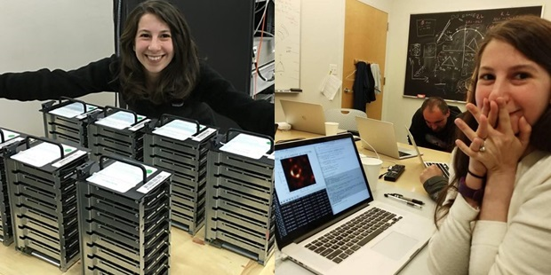

In this workshop, we will select one of the available dataset and, in group, we will use R to extract insghts from it.

## Datasets

The datasets are available at [The City of Calgary's open data portal](https://data.calgary.ca/).

We selected the following datasets:

* *[Fire Emergency Response Calls](https://data.calgary.ca/Government/Fire-Emergency-Response-Calls/bdez-pds9)*: This dataset contains daily count of incidents responded by incident type.

{width=250px}

* *[Historical Community Populations](https://data.calgary.ca/Demographics/Historical-Community-Populations/jtpc-xgsh)*: The population, occupied dwelling count, and person per unit calculation of Calgary communities since 1968. 

{width=250px}

* *[Licensed Pets](https://data.calgary.ca/Services-and-Amenities/Licensed-Pets/5dgy-88cq)*: All cats and dogs over three months of age and residing in Calgary must be licensed with The City of Calgary. If you do not license your cat or dog, you could face a $250 fine. 

{width=250px}

* *[Pets Impound Outcomes](https://data.calgary.ca/Services-and-Amenities/Pets-Impound-Outcomes/jmrf-j94e)*: Impounded cats and dogs are animals sheltered at the Animal Service Centre because they were running at large in their communities, a violation under the Responsible Pet Ownership Bylaw. 

{width=250px}

* *[Water Single Family Consumption](https://data.calgary.ca/Government/Water-Single-Family-Consumption/j7mp-h975)*: This dataset contains single family includes consumption of metered and flat rate customers living in detached homes and duplexes.

{width=250px}

The csv files are available in our GitHub repository and for the goal of this workshop, we've deleted some columns from the datasets with the name endend with "_workshop.csv"

## Workshop 

### Before working on the Data Analysis

1. Now that we know a little bit about the datasets, let's group. Each group should have at least one participant that attended a previous meeting.

2. As a group, select one of the 5 datasets to work with today.

3. Explore the csv file and the dataset webpage.

4. Define the analytical questions you and your group want to answer by the end of this event. 

### Data Preparation and Data Analysis 

1. Install and load the `tidyverse` library
2. Set working directory
3. Locate current working directory
4. Display the list of files present in that directory
5. Read the selected csv file
6. Explore the data structure
7. Explore the dataset dimensions (number of rows and number of columns)
8. Display the first and last rows of the dataset  
9. Is there any missing data? If yes, remove the rows with at least one column with `NA`
10. If it makes sense, create new variables from the column that represents date (ex.: `month`,`year`, `weekdays`,`quarters`)
11. Create any other variable you think will provide insights
12. Create summarized tables using Data manipulation with`dplyr`: On meeting #5 you will find some examples on how to use the `dplyr` functions `select`, `filter`, `arrange`, `rename`, `mutate`, and `summarise`
13. Create plots using `ggplot2`. Example: barplots, boxplots, histograms, time series plots, scatter plot, among others. Search on Google different ways to present the results by month or year, by groups... You can find some examples on meeting #4 and meeting #5.

### Storytelling

Make a small report in word or a presentation in powerpoint showing your finds. Were you able to answer the analytical questions?

If you liked the dataset topic, you can keep working on it in R and use the R code you developed as part of your GitHub work portfolio. 

### Congratulations everyone, you are amazing!!!
### I hope you had fun!!!

