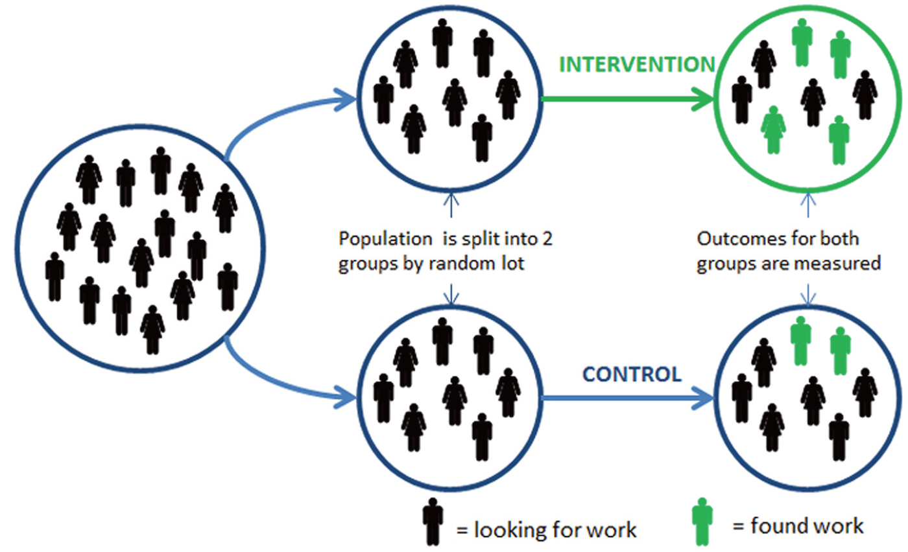
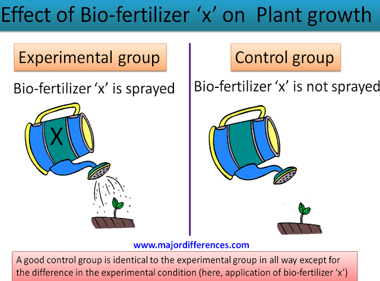
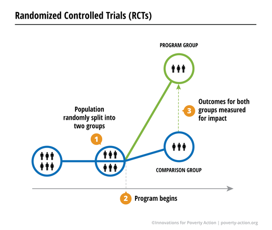
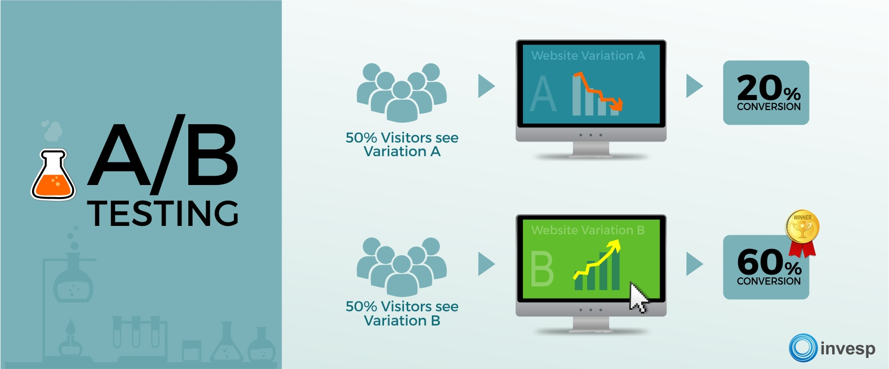

<style type="text/css">
h1.title {
  font-size: 68px;
  color: #ED553B;
  text-align: center;
}
h3.subtitle { 
  font-size: 28px;
  font-family: "Times New Roman", Times, serif;
  color: black;
  text-align: center;
}
h4.author { 
  font-size: 18px;
  font-family: "Times New Roman", Times, serif;
  color: Black;
  text-align: center;
}
h4.date { 
  font-size: 18px;
  font-family: "Times New Roman", Times, serif;
  color: Black;
  text-align: center;
}
</style>


## What is A/B testing?

"A/B testing (also known as **bucket tests** or **split-run testing**) is a **randomized experiment** with two variants, A and B. It includes application of statistical **hypothesis testing** or "two-sample hypothesis testing" as used in the field of statistics. A/B testing is a way to compare two versions of a single variable, typically by testing a subject's response to variant A against variant B, and determining which of the two variants is more effective."

Source: [Wikipedia](https://en.wikipedia.org/wiki/A/B_testing)


<center>
 {width=450px}
</center>
[Image](https://www.optimizely.com/optimization-glossary/ab-testing/)


Watch the [video](https://www.facebook.com/business/help/1738164643098669?id=162694231107536) to understand the basics of A/B testing (also called split testing).

Randomized controlled experiment is vastly used by pharmaceutical companies, medical scientists, agricultural research, among others.

### Example 1
<center>
{width=350px}
</center>
[Image](https://emmatomkinson.com/2013/05/20/randomised-controlled-trials-rcts-in-public-policy/)


### Example 2
<center>
{width=350px}
</center>
[Image](https://www.majordifferences.com/2016/11/5-differences-between-control-group-and.html#.Xc9mKFdKjZs)
</center>


### Example 3
<center>
{width=350px}
</center>
[Image](https://www.poverty-action.org/about/randomized-control-trials)

In summary, "A/B testing can be a randomized controlled experiment, assuming you've controlled factors and randomized subjects, but not all randomized controlled experiments are A/B tests."


## Why A/B testing is an important tool?

A/B testing is used to determine effects of digital marketing effort, specially because in this industry, small changes can have big effects.

<center>
{width=250px}
</center>
[Image](https://smith.queensu.ca/executiveeducation/success_story/images/little_things_add_up.jpg)

## How to use A/B testing?

To run an A/B Testing, it is necessary:

* create two different versions of one piece of content
* test these two versions to two similarly sized groups 
* analyze which one performed better over a **specific period of time** (long enough to make accurate conclusions about your results)

<center>
 {width=500px}
</center>

[Image]('https://www.invespcro.com/blog/tips-to-run-ab-tests-the-right-way/')

## Examples of A/B testing uses

* change in a single headline 
* redesign of the webpage or app screen
* color of a Call to Action button
* the wording of a headline
* the distribution of text on the page
* the menu layouts

## The A/B testing process

The following describes the basic flow of a scientific step-by-step process that you can use for A/B Split Testing.

* Identify the problem 
* Get insights on targeted audience
* Formulate a hypothesis
* Calculate the required number of observations (visitors per day)
* Test your hypothesis
* Check out the impact of your variations based on measurable metrics
* Data analysis
  * If no significant changes or improvements were generated, you may need to perform additional tests
* Report


## A/B testing errors
In hypothesis testing there are three possible outcomes of the test:

* No error
* Type I error
* Type II error

With **no error** everything is clear.

**Type I error** (beware! this is a really serious error) occurs when you incorrectly **_reject the null hypothesis_** and conclude that there is actually a **_difference_** between the original page and the variation **_when there really isn't_**. In other words, you obtain **_false positive_** test results. Like the name indicates, a false positive is when you think one of your test challengers is a winner while in reality it is not.

**Type II** error occurs when you **_fail to reject the null hypothesis_** at the right moment, obtaining this time **_false negative_** test results. Type II error occurs when we conclude test with the assumption that none of the variations beat the original page while in reality one of them actually did.

**Type I and type II errors cannot happen at the same time**:

* Type I error happens only when the null hypothesis is true
* Type II error happens only when hypothesis is false

Keep in mind that statistical errors are unavoidable.

However, the more you know how to quantify them the more you get accurate results.

When conducting hypothesis testing, you cannot "100%" prove anything, but you can get statistically significant results.

[Source: A/B Testing Statistics Made Simple](https://www.invespcro.com/blog/ab-testing-statistics-made-simple/) 

<center>

</center>


## Common test statistics
<center>

</center>
[Source: Wikipedia](https://en.wikipedia.org/wiki/A/B_testing)

## A/B testing in R

Now, that we've learned what A/B testing is, let's do some A/B testing in R.

### About the dataset
For this exercise, we are going to use the material and the 'click_data.csv' dataset used by DataCamp in the free Chapter of the [A/B Testing in R](https://www.datacamp.com/courses/ab-testing-in-r) course.

The dataset will be a generated example of a **cat adoption website**. You will investigate if changing the homepage image affects conversion rates (the percentage of people who click a specific button). 
<center>
{width=300px} {width=300px}
</center>

<center>

</center>


```{r include=TRUE,echo = TRUE, message = FALSE, warning = FALSE}
# Load the libraries
library(tidyverse)
library(data.table)

# Read in data
click_data <- fread('https://assets.datacamp.com/production/repositories/2292/datasets/4407050e9b8216249a6d5ff22fd67fd4c44e7301/click_data.csv')
click_data
```


Let's find oldest and most recent date
```{r include=TRUE,echo = TRUE, message = FALSE, warning = FALSE}
min(click_data$visit_date)
max(click_data$visit_date)
```

Now that we know we have one year of data, let's determine our baseline conversion rates.

### Baseline conversion rates

What 'more' means in this context? 

Compared the conversion rate to when? 


<center>

</center>

Calculate the mean conversion rate by month

```{r include=TRUE,echo = TRUE, message = FALSE, warning = FALSE}
library(lubridate)
click_data$month <- month(click_data$visit_date)

click_data_month <- click_data %>%
  group_by(month) %>%
  summarize(conversion_rate = mean(clicked_adopt_today))
click_data_month
```

```{r include=TRUE,echo = TRUE, message = FALSE, warning = FALSE}
library(scales)
ggplot(click_data_month, aes(x=month, y=conversion_rate)) +
  geom_point() + 
  geom_line() +
  scale_y_continuous(labels = scales::percent, limits=c(0,1)) 
```

Calculate the mean conversion rate by day of the week

```{r include=TRUE,echo = TRUE, message = FALSE, warning = FALSE}
click_data$wday <- wday(click_data$visit_date)

click_data_wday <- click_data %>%
  group_by(wday) %>%
  summarize(conversion_rate = mean(clicked_adopt_today))
click_data_wday
```

```{r include=TRUE,echo = TRUE, message = FALSE, warning = FALSE}
ggplot(click_data_wday, aes(x=wday, y=conversion_rate)) +
  geom_point() + 
  geom_line()+
  scale_y_continuous(labels = scales::percent, limits=c(0,1))
```

Calculate the mean conversion rate by week of the year

```{r include=TRUE,echo = TRUE, message = FALSE, warning = FALSE}
click_data$week <- week(click_data$visit_date)

click_data_week <- click_data %>%
  group_by(week) %>%
  summarize(conversion_rate = mean(clicked_adopt_today))
click_data_week
```

```{r include=TRUE,echo = TRUE, message = FALSE, warning = FALSE}
ggplot(click_data_week, aes(x=week, y=conversion_rate)) +
  geom_point() + 
  geom_line() +
  scale_y_continuous(labels = scales::percent, limits=c(0,1))
```


### Experimental design, power analysis

Based on the previous data analysis, we have our baseline numbers and we can determine for how long we should run our experiment.

But before start the experiment, we should ask some important questions:

* How long should we run the experiment?
* How many data points (sample size) should we get?
* How many website hits we get per day?
* What statistical test should I use?
* What is the expected value for the test condition?

Besides anwering the questions, is important to determine:

* The proportion of the data for each condition
* Statistical significance threshold/alpha - level where effect sgnificant (generally is 0.05)
* power/ 1 - beta - probability correctly rejecting null hypothesis (generally 0.8)

### Power analysis in R
Now, let's calculate the sample sizes using the package 'powerMediation'.

Suppose we will run the experiment starting in January, we expect roughly a 20% conversion rate (p1), let's assume that the test condition expect a convertion rate of 30% (p2).

For sample porportion (beta), alpha, and power we will use the most common values (0.5, 0.05, and 0.8, respectively)


```{r include=TRUE,echo = TRUE, message = FALSE, warning = FALSE}
library(powerMediation)

total_sample_size <- SSizeLogisticBin(p1 = 0.2, 
                 p2 = 0.3,
                 B = 0.5, 
                 alpha = 0.05,
                 power = 0.8)
total_sample_size
```

```{r include=TRUE,echo = TRUE, message = FALSE, warning = FALSE}
total_sample_size/2
```

Now is your turn. 

* How many data points you need in total across both conditions, if we decide to run the experiment in August? 
Make sure you round the percentages!


* Let's say you've reconsidered your expectations for running the experiment in August. Because, increasing the conversion rate by 10 percentage points may be difficult. Rerun your power analysis assuming only a 5 percentage point increase in your conversion rate for the test condition. 


Now, we are going to use the exemple presented in the article [Tips for A/B Testing with R](https://www.r-bloggers.com/tips-for-ab-testing-with-r/). We will test the difference between two rates in R, e.g., click-through rates or conversion rates from two tested conditions. 


```{r include=TRUE,echo = TRUE, message = FALSE, warning = FALSE}
library(readr) 

# Specify file path: 
dataPath <-   "https://www.inwt-statistics.de/files/INWT/downloads/exampleDataABtest.csv" 

# Read data 
data <- read_csv(file = dataPath)  

head(data)
```
```{r include=TRUE,echo = TRUE, message = FALSE, warning = FALSE}
# Inspect structure of the data 
str(data)
```

```{r include=TRUE,echo = TRUE, message = FALSE, warning = FALSE}

# Change type of group to factor  
data$group <- as.factor(data$group)  

# Change type of click through variable to factor
data$clickedTrue <- as.factor(data$clickedTrue) 
levels(data$clickedTrue) <- c("0", "1") 
str(data)
```

Let's find oldest and most recent date
```{r include=TRUE,echo = TRUE, message = FALSE, warning = FALSE}
min(data$time)
max(data$time)
```

To **test the difference between two proportions**, you can also use the **Pearson's chi-squared test**. For **small samples you should use Fisher's exact test** instead. 

The prop.test function returns a p-value and a confidence interval for the difference between the two rates. 

```{r include=TRUE,echo = TRUE, message = FALSE, warning = FALSE}
# Compute frequencies and conduct test for proportions  
# (Frequency table with successes in the first column) 
freqTable <- table(data$group, data$clickedTrue)[, c(2,1)]  

# print frequency table 
freqTable  
```

```{r include=TRUE,echo = TRUE, message = FALSE, warning = FALSE}
# Conduct significance test 
prop.test(freqTable, conf.level = .95) 
```

Based on the test result, with the significance level of 5%, we reject the null hypothesis (p-value = 0.01141), which means that there are statistical evidence that the condition A conversion rate differ from the tested condition (B).

* What else can we say about the results?
* How to interpret the confidence interval
values?
* What is the power of this experiment? Is it greater than 80%?


<center><font size="20"> **Congratulations everyone!!!**</font>

<font size="10"> **I am so proud of you!**</font>


</center>


## References and Extra Resources

If you'd like to learn more about A/B Testing and/or A/B Testing in R, here some resources:

* [A Refresher on Randomized Controlled Experiments](https://hbr.org/2016/03/a-refresher-on-randomized-controlled-experiments)
* [A/B Testing](https://www.optimizely.com/optimization-glossary/ab-testing/)
* [The Importance of A/B Split Testing to Improve the Performance of Your PPC Campaign](https://digitalmarketingphilippines.com/the-importance-of-ab-split-testing-to-improve-the-performance-of-your-ppc-campaign/)
* [How to Do A/B Testing: A Checklist You'll Want to Bookmark](https://blog.hubspot.com/marketing/how-to-do-a-b-testing)
* [A/B Testing with Machine Learning - A Step-by-Step Tutorial](https://www.business-science.io/business/2019/03/11/ab-testing-machine-learning.html)
* [DataCamp: A/B Testing in R](https://www.datacamp.com/courses/ab-testing-in-r)
* [Udacity: A/B Testing by Google]( https://www.udacity.com/course/ab-testing--ud257)
* [Udacity: A/B Testing for Business Analysts]( https://www.udacity.com/course/ab-testing--ud979)
* [Building an A/B Testing Analytics System with R and Shiny]( https://www.youtube.com/watch?v=zDONDfXzKdA)
